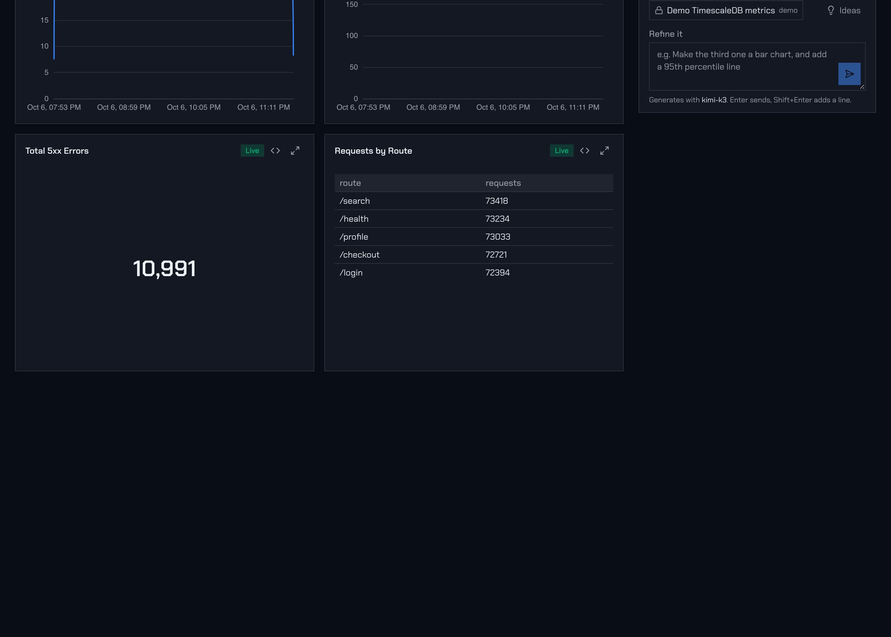
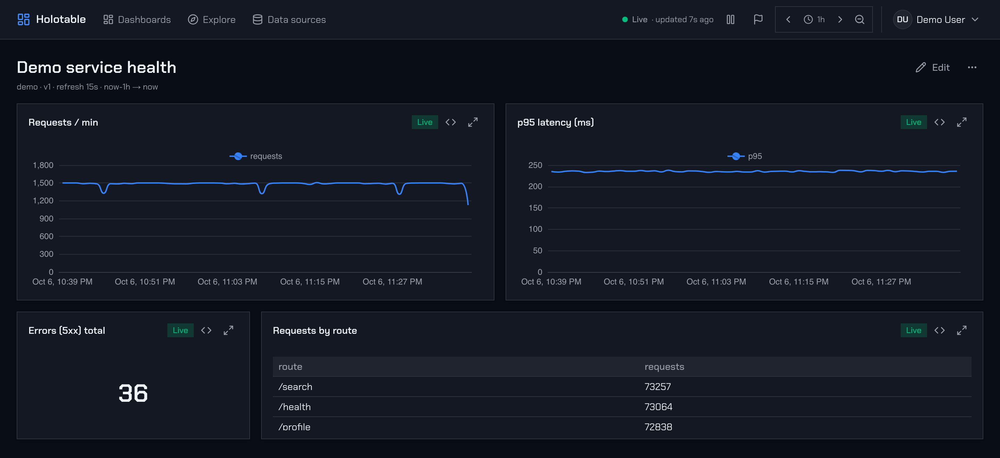

# Holotable

[](https://github.com/jbouder/holotable/actions/workflows/ci.yml)

Natural-language monitoring dashboards. Describe what you want to see; a language
model authors a **validated visualization spec** (SQL + chart config) — never the
data itself — and Holotable executes the guarded SQL against TimescaleDB and
streams the results live.

**Stack:** Next.js 16 (App Router) · TypeScript · Tailwind v4 · Base UI · ECharts ·
TimescaleDB/PostgreSQL · Vercel AI SDK · Keycloak OIDC · Server-Sent Events. One
shared Zod IR (`src/lib/ir.ts`) is the contract between the model, the API,
persistence and the browser.





## Quick start

Try it in one container, with demo data and no sign-in (or open the
[public demo](https://holotable-demo.vibeproject.workers.dev)):

```bash
docker run -p 3000:3000 ghcr.io/jbouder/holotable:quickstart
```

Then open <http://localhost:3000>. With Docker Compose instead (Keycloak, real
sign-in as `demo` / `demo`, your own `.env`):

```bash
cp .env.example .env    # then set SESSION_SECRET, AI_MODEL and its key, and
                        # OIDC_CLIENT_SECRET=holotable-dev-secret (the local realm's)
docker compose up
```

The [quick start](https://holotable-docs.beskar.workers.dev/getting-started/quick-start/)
covers both, Helm, and the development loop.

## Documentation

Everything is explained once, on the docs site
(<https://holotable-docs.beskar.workers.dev>, source in [`docs/`](docs/)):

- [Your first dashboard](https://holotable-docs.beskar.workers.dev/getting-started/your-first-dashboard/) — from an empty install to a live dashboard over your own database.
- [How it works](https://holotable-docs.beskar.workers.dev/concepts/how-it-works/) — a panel from prompt to live chart.
- [Invariants](https://holotable-docs.beskar.workers.dev/architecture/invariants/) — the guarantees the design rests on.
- [Configuration](https://holotable-docs.beskar.workers.dev/reference/configuration/) — every environment variable, generated from `src/lib/config.ts`.
- [Keycloak setup](https://holotable-docs.beskar.workers.dev/operations/keycloak/) — the OIDC client and group mapper.
- [API routes](https://holotable-docs.beskar.workers.dev/reference/api-routes/) and [Deploying on Kubernetes](https://holotable-docs.beskar.workers.dev/operations/kubernetes/).

## Contributing, security, license

- [`CONTRIBUTING.md`](CONTRIBUTING.md) — local setup, the checks CI runs, conventions, and the invariants a change must not break.
- [`SECURITY.md`](SECURITY.md) — the trust model, and how to report a vulnerability privately.
- Licensed under the [Apache License 2.0](LICENSE); see [`NOTICE`](NOTICE).
